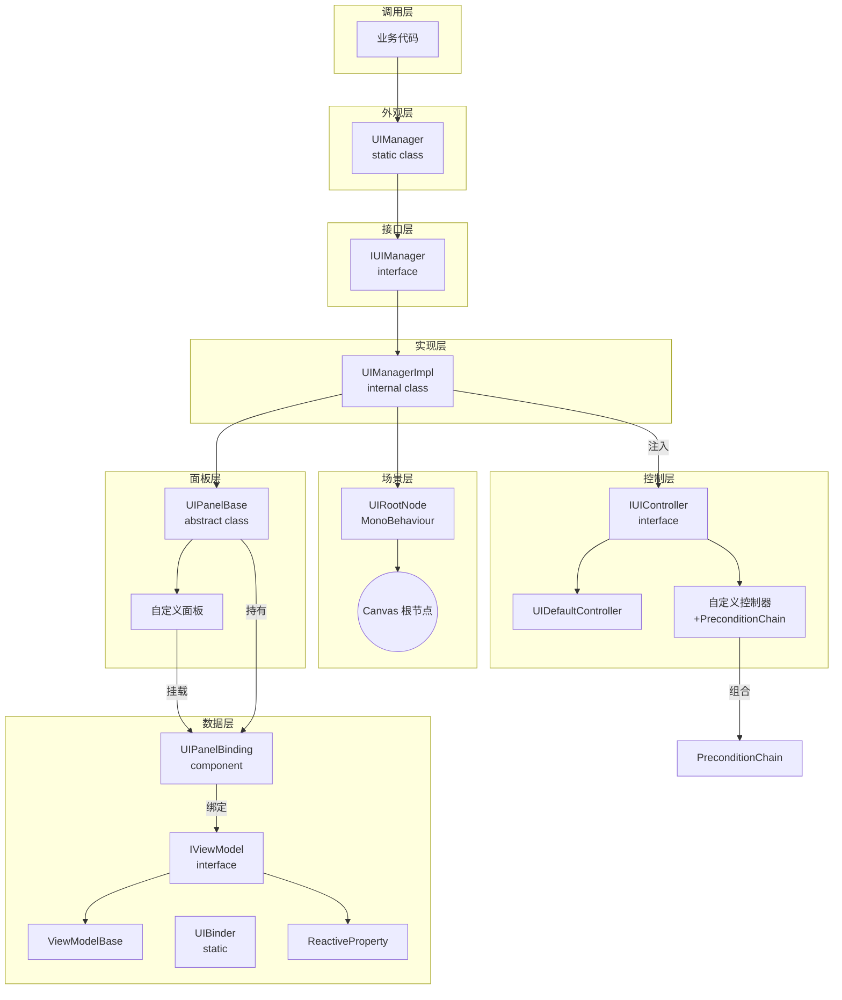
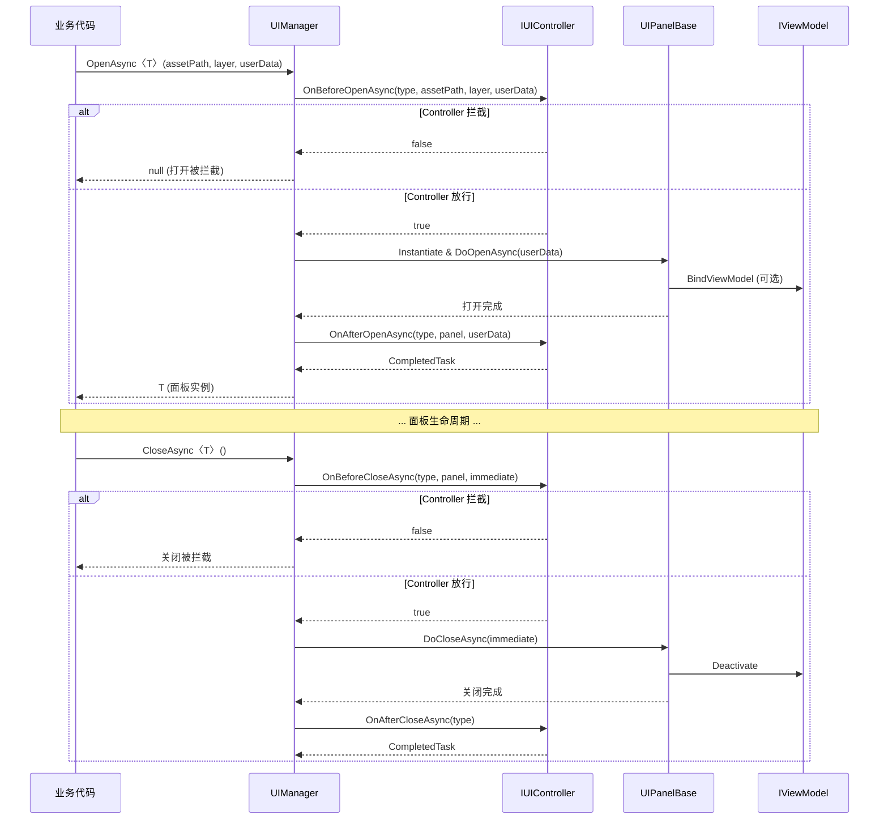

# XFramework / UI 模块

## 概述

XFramework UI 模块提供完整的 UI 面板管理功能。通过 `IUIManager` 接口抽象，支持面板打开/关闭、导航堆栈、模态遮罩、资源预加载缓存、层级排序以及与本地化模块的联动。所有面板预制体通过 YooAsset（`AssetManager`）异步加载，支持打开/关闭动画。

此外还提供 **MVVM 数据绑定**（View ↔ ViewModel 基于 ReactiveProperty）和 **调度控制**（通过 IUIController + PreconditionChain 实现面板生命周期 AOP 拦截）。

**命名空间**: `XFramework.XUI`

## 架构设计

```
Runtime/UI/
├── IUIManager.cs              # UI 管理器公共接口
├── UIManager.cs               # 静态外观（全局入口）
├── UIManagerImpl.cs           # 默认实现（面板字典、导航堆栈、资源缓存）
├── UIPanelBase.cs             # 面板基类（所有 UI 面板需继承）
├── UIRootNode.cs              # 场景 Canvas 载体（初始化 UIManager）
├── README.md                  # 使用说明
├── Controller/
│   ├── IUIController.cs       # 调度控制接口（五阶段生命周期拦截）
│   ├── UIDefaultController.cs # 默认控制器（全部放行）
│   └── PreconditionChain.cs   # 前提条件链（链式组合异步校验条件）
└── Data/
    ├── IViewModel.cs          # ViewModel 接口
    ├── ViewModelBase.cs       # ViewModel 抽象基类
    ├── UIPanelBinding.cs      # UI 绑定组件（挂载在 Panel Prefab 上，约定式绑定）
    ├── UIBinder.cs            # UI 绑定工具（静态扩展方法，手动精确绑定）
    └── ReactiveProperty.cs    # 响应式属性（View ↔ ViewModel 数据绑定核心）
```

## 四层架构



## 生命周期流程（含 Controller 拦截）



## 核心类型

| 类型                      | 所属层 | 职责                                                                                                                             |
| ------------------------- | ------ | -------------------------------------------------------------------------------------------------------------------------------- |
| **UIManager**             | 外观层 | 全局 UI 管理器静态外观（单例）。所有调用入口。                                                                                   |
| **IUIManager**            | 接口层 | UI 管理器接口。定义所有可用操作。                                                                                                |
| **UIManagerImpl**         | 实现层 | 内部实现。维护活动面板字典、导航堆栈、遮罩管理、预加载缓存与排序计数器。支持注入 IUIController 拦截生命周期。                    |
| **UIPanelBase**           | 面板层 | 面板基类。提供 OnOpen / OnClose / OnFocus / OnBlur / OnLanguageChanged 生命周期与动画钩子，内置 ViewModel 绑定方法。             |
| **UIRootNode**            | 场景层 | 挂在场景 Canvas 上的 Mono。自动初始化 UIManager。                                                                                |
| **IUIController**         | 控制层 | **调度控制接口**。五阶段生命周期拦截：打开前/后、关闭前/后、全部关闭后。                                                         |
| **UIDefaultController**   | 控制层 | 默认实现，全部放行。通过 Debug.Log 输出拦截日志。                                                                                |
| **PreconditionChain**     | 控制层 | **前提条件链**。在自定义 Controller 的 OnBeforeOpenAsync 中链式组合校验条件。                                                    |
| **IViewModel**            | 数据层 | **ViewModel 接口**。标记型，纯粹的类型约束。                                                                                     |
| **ViewModelBase**         | 数据层 | ViewModel 抽象基类。封装 ReactiveProperty 的创建，提供 Initialize/Activate/Deactivate 生命周期。                                 |
| **UIPanelBinding**        | 数据层 | **UI 绑定组件**。挂载在 Panel Prefab 上，持有 IViewModel 引用，提供约定式绑定（BindByConvention）与生命周期管理。                |
| **UIBinder**              | 数据层 | **UI 绑定工具**。静态扩展方法，提供 BindToText/BindToSlider/BindToClick 等精确绑定，支持 format 格式化。与 UIPanelBinding 互补。 |
| **ReactiveProperty\<T\>** | 数据层 | **响应式属性**。值变更时自动通知订阅者，是 View ↔ ViewModel 数据绑定核心。                                                       |

## 核心概念

### 层级系统

使用 `int` 类型表示层级，数值越大越靠前。通过 `UIRootNode` 提供预设常量，也可自定义：

```
Background (0)   — 背景层（主界面背景、HUD）
Default (100)    — 默认层（大部分面板）
Popup (200)      — 弹出层（弹窗、确认框）
Top (300)        — 顶层（Toast、加载提示、系统消息）
Mask (500)       — 模态遮罩层
```

每个层级内部的面板通过 `sortingOrder` 自动排序（`sortingOrder = layer × 1000 + 序号`），后打开的面板排序值更大。

### 导航堆栈

支持 `PushAsync` / `PopAsync` / `BackToAsync` 导航模式：

- `PushAsync` — 压入新面板，当前面板失焦（OnBlur），新面板获得焦点（OnOpen）
- `PopAsync` — 弹出栈顶面板并关闭，恢复上一个面板焦点（OnFocus）
- `BackToAsync` — 回到指定类型面板，中间经过的面板依次关闭
- `HasPrevious` — 导航堆栈中是否还有上一个面板

### 模态遮罩

通过 `ShowMask` / `HideMask` 创建全屏半透明遮罩，阻止下方 UI 交互：

- 支持设置透明度（alpha 0-1）
- 支持点击关闭（clickToClose）—— 点击遮罩自动 Pop 栈顶面板
- 遮罩位于独立层级（默认 Mask 层），不影响面板排序

### 资源缓存

预加载面板预制体到内存缓存，后续 `OpenAsync` 时直接从缓存实例化：

```csharp
// 预加载——后续打开时不卡顿
await UIManager.PreloadAsync<SettingsPanel>("ui/panels/settings");

// 移除指定缓存
UIManager.UnloadAsset<SettingsPanel>();

// 清空所有缓存（切换场景时）
UIManager.ClearAssetCache();
```

## 快速使用

### 1. 场景设置

在场景中创建一个 `UIRootNode`：

1. 右键 → `GameObject` → `UI` → `Canvas` 创建 Canvas
2. 向 Canvas 添加 `UIRootNode` 组件（`Add Component → UIRootNode`）
3. Canvas 的 `Render Mode` 自动设为 `Screen Space - Overlay`

`UIRootNode` 的 `Awake` 中自动调用 `UIManager.Initialize(transform)`，`OnDestroy` 中自动清理所有资源。

也可以在代码中手动初始化并注入自定义 Controller：

```csharp
// 代码初始化 + 注入自定义 Controller
var uiRoot = GameObject.Find("UIRoot").transform;
UIManager.Initialize(uiRoot, new MyGameController());
```

### 2. 自定义 Controller（可选：调度控制）

如果你不需要面板打开/关闭的拦截逻辑，可以跳过此步骤。默认 Controller 全部放行。

```csharp
using Cysharp.Threading.Tasks;
using XFramework.XUI;
using XFramework.XUI.Controller;

/// <summary>
/// 业务自定义控制器：面板打开前校验登录状态、关闭时的二次确认等。
/// </summary>
public class MyGameController : IUIController
{
    public async UniTask<bool> OnBeforeOpenAsync(
        Type panelType, string assetPath, int layer, object userData)
    {
        // 使用 PreconditionChain 链式组合校验条件
        var chain = new PreconditionChain(panelType, assetPath, layer, userData)
            .Add(CheckLoginAsync)
            .Add(CheckDailyLimitAsync);

        return await chain.ExecuteAsync();
    }

    public UniTask OnAfterOpenAsync(Type panelType, UIPanelBase panel, object userData)
        => UniTask.CompletedTask;

    public async UniTask<bool> OnBeforeCloseAsync(
        Type panelType, UIPanelBase panel, bool immediate)
    {
        // 关闭前的二次确认弹窗
        if (panelType == typeof(ShopPanel))
        {
            if (!immediate)
            {
                var confirmed = await ShowConfirmDialog("确定要关闭商店吗？");
                return confirmed;
            }
        }
        return true;
    }

    public UniTask OnAfterCloseAsync(Type panelType)
        => UniTask.CompletedTask;

    public UniTask OnAllPanelsClosedAsync()
        => UniTask.CompletedTask;

    // --- 前提条件示例 ---

    private async UniTask<bool> CheckLoginAsync(
        Type panelType, string assetPath, int layer, object userData)
    {
        // 某些面板不需要登录
        if (panelType == typeof(LoginPanel) || panelType == typeof(RegisterPanel))
            return true;

        if (!GameManager.Instance.IsLoggedIn)
        {
            // 自动弹出登录面板
            await UIManager.PushAsync<LoginPanel>("Assets/UI/Login.prefab", 500);
            return false; // 中断链
        }
        return true;
    }

    private UniTask<bool> CheckDailyLimitAsync(
        Type panelType, string assetPath, int layer, object userData)
    {
        return UniTask.FromResult(true);
    }

    private async UniTask<bool> ShowConfirmDialog(string message)
    {
        var dialog = await UIManager.PushAsync<ConfirmDialog>(
            "Assets/UI/ConfirmDialog.prefab", 900);
        await dialog.WaitForResultAsync();
        return dialog.Result;
    }
}
```

### 3. MVVM 数据绑定（可选）

**3.1 两种绑定风格**

| 风格                   | 类                                     | 适合场景                                                            |
| ---------------------- | -------------------------------------- | ------------------------------------------------------------------- |
| **约定式**（零代码）   | `UIPanelBinding`（MonoBehaviour 组件） | 标准面板，子节点按 `txt_xxx` / `img_xxx` / `btn_xxx` 命名，自动匹配 |
| **精确式**（手动控制） | `UIBinder`（静态扩展方法）             | 需要 format 格式化、按钮点击绑定、非标准组件、大世界 UI             |

两者互补，可在同一个面板中混用。

**3.2 创建 ViewModel**

```csharp
using XFramework.XUI.Data;

public class SettingsViewModel : ViewModelBase
{
    // 使用 ViewModelBase 的 CreateProperty 方法创建响应式属性
    public ReactiveProperty<float> MusicVolume { get; private set; }
    public ReactiveProperty<bool> SoundEnabled { get; private set; }
    public ReactiveProperty<string> PlayerName { get; private set; }

    protected override void OnInitialize()
    {
        MusicVolume = CreateProperty(0.5f);
        SoundEnabled = CreateProperty(true);
        PlayerName = CreateProperty("Player");

        // 监听属性变化
        MusicVolume.Subscribe(v => Debug.Log($"音量变化: {v}"));
    }

    protected override void OnActivate()
    {
        // 面板打开时的逻辑（加载存档数据等）
        LoadSettings();
    }

    protected override void OnDeactivate()
    {
        // 面板关闭时的逻辑（保存设置等）
        SaveSettings();
    }
}
```

**3.3 在面板中使用 ViewModel（约定式 — UIPanelBinding）**

```csharp
public class SettingsPanel : UIPanelBase
{
    public Slider musicSlider;
    public Toggle soundToggle;
    public TMP_InputField nameInput;

    protected override async UniTask OnOpen(object userData)
    {
        var vm = new SettingsViewModel();
        await vm.InitializeAsync();

        // 方式一：手动绑定（推荐，按命名约定）
        Binding.BindByConvention("MusicVolume", vm.MusicVolume);
        Binding.BindByConvention("SoundEnabled", vm.SoundEnabled);
        Binding.BindByConvention("PlayerName", vm.PlayerName);

        // 方式二：完整绑定 ViewModel（等价写法）
        // BindViewModel(vm);
    }
}
```

**3.4 命名约定（BindByConvention）**

| ReactiveProperty 名称 | 自动绑定到的 UI 子节点名                             |
| --------------------- | ---------------------------------------------------- |
| `MusicVolume`         | `MusicVolume` → Slider.value                         |
| `SoundEnabled`        | `SoundEnabled` → Toggle.isOn                         |
| `PlayerName`          | `PlayerName` → InputField.text / TMP_InputField.text |
| `TitleText`           | `TitleText` → Text.text / TMP_Text.text              |
| `Count`               | `Count` → Slider.value (int)                         |
| `IsSelected`          | `IsSelected` → Toggle.isOn                           |

> 约定规则：面板下子 GameObject 名与 ReactiveProperty 名相同，自动根据 UI 组件类型选择对应属性进行绑定。

**3.5 精确式绑定（UIBinder）**

适用于需要格式化、按钮点击、非标准组件或大世界 UI 等场景：

```csharp
using XFramework.XUI.Data;

public class ShopPanel : UIPanelBase
{
    public TMP_Text currencyText;
    public Button btnBuy;
    public Image hpBar;

    private ShopViewModel _vm = new ShopViewModel();

    protected override async UniTask OnOpen(object userData)
    {
        await _vm.InitializeAsync();

        // 使用 UIBinder 扩展方法 — 支持 format 格式化
        _vm.Currency.BindToText(currencyText, g => $"{g:N0}");

        // 使用 ReadOnlyReactiveProperty（通过 Select 链式创建）
        _vm.Hp.Select(h => h / 100f).BindToFillAmount(hpBar);

        // 按钮点击绑定
        btnBuy.BindToClick(_vm.OnClickBuy);

        // 自定义绑定
        _vm.Level.Bind(lv => SetLevelBadge(lv));
    }
}
```

### 4. 创建面板

所有 UI 面板需继承 `UIPanelBase`：

```csharp
using XFramework.XUI;

public class MainMenuPanel : UIPanelBase
{
    protected override async UniTask OnOpen(object userData)
    {
        // 面板打开逻辑：绑定按钮事件、初始化文本等
        var title = transform.Find("Title").GetComponent<TMP_Text>();
        title.text = "主菜单";

        // 创建并绑定 ViewModel（可选）
        var vm = new MainMenuViewModel();
        await vm.InitializeAsync();
        BindViewModel(vm);
    }

    protected override async UniTask OnClose()
    {
        // 面板关闭逻辑：清理事件绑定、释放资源等
    }

    // 可选：打开动画
    protected override async UniTask PlayOpenAnimation()
    {
        var canvasGroup = GetComponent<CanvasGroup>();
        canvasGroup.alpha = 0f;
        await canvasGroup.FadeIn(0.3f); // DOTween 或自定义
    }

    // 可选：关闭动画
    protected override async UniTask PlayCloseAnimation()
    {
        var canvasGroup = GetComponent<CanvasGroup>();
        await canvasGroup.FadeOut(0.2f);
    }

    // 可选：语言切换回调
    protected override void OnLanguageChanged(string lang)
    {
        // 刷新面板文本
    }
}
```

### 5. 打开/关闭面板

```csharp
using XFramework.XUI;

// 打开面板
var mainMenu = await UIManager.OpenAsync<MainMenuPanel>(
    "ui/panels/mainmenu",    // YooAsset 预制体地址
    layerDefault,             // 层级（可选，默认 100）
    userData                  // 自定义数据（可选，默认 null）
);

// 关闭面板（通过类型）
await UIManager.CloseAsync<MainMenuPanel>();

// 关闭面板（带关闭动画）
await UIManager.CloseAsync<MainMenuPanel>(immediate: false);

// 关闭面板（立即销毁，跳过动画）
await UIManager.CloseAsync<MainMenuPanel>(immediate: true);

// 面板关闭自身
await this.CloseSelfAsync();

// 查询面板状态
bool isOpen = UIManager.IsOpen<MainMenuPanel>();
var panel = UIManager.GetPanel<MainMenuPanel>(); // 未打开返回 null
```

### 6. 导航堆栈

```csharp
// 从主菜单进入设置——主菜单失焦，设置面板获得焦点
var settings = await UIManager.PushAsync<SettingsPanel>(
    "ui/panels/settings",
    layerDefault
);

// 从设置进入音效子面板
await UIManager.PushAsync<SoundPanel>("ui/panels/sound", layerDefault);

// 返回上一面板（关闭音效面板，恢复设置面板）
await UIManager.GoBackAsync();

// 或使用 PopAsync（等价于 GoBackAsync）
await UIManager.PopAsync();

// 直接从音效回到主菜单（中间的面板依次关闭）
await UIManager.BackToAsync<MainMenuPanel>();

// 检查是否可以返回
if (UIManager.HasPrevious)
{
    await UIManager.GoBackAsync();
}
```

### 7. 模态遮罩

```csharp
// 显示遮罩（半透明，不支持点击关闭）
UIManager.ShowMask(alpha: 0.5f);

// 显示遮罩（支持点击关闭——自动 Pop 栈顶）
UIManager.ShowMask(alpha: 0.3f, clickToClose: true);

// 隐藏遮罩
UIManager.HideMask();

// 查询遮罩状态
bool showing = UIManager.IsMaskShowing;
```

### 8. 关闭指定层级

```csharp
// 关闭 Default 层的所有面板
await UIManager.CloseLayerAsync(layerDefault);

// 关闭所有面板
await UIManager.CloseAllAsync();
```

### 9. 资源预加载

```csharp
// 游戏启动后预加载所有常用面板，后续打开零延迟
await UIManager.PreloadAsync<MainMenuPanel>("ui/panels/mainmenu");
await UIManager.PreloadAsync<SettingsPanel>("ui/panels/settings");
await UIManager.PreloadAsync<DialogPanel>("ui/panels/dialog");

// 场景切换时清理不用的缓存
UIManager.ClearAssetCache();
```

### 10. 语言切换联动

与 `LocalizationManager` 联动，语言切换时自动通知所有已打开面板刷新：

```csharp
// 注册语言切换回调
XLocalization.LocalizationManager.OnLanguageChanged += UIManager.OnLanguageChanged;

// 或手动触发刷新（不经过 LocalizationManager）
UIManager.OnLanguageChanged("ja");
```

面板中重写 `OnLanguageChanged` 方法：

```csharp
public class MainMenuPanel : UIPanelBase
{
    public TMP_Text titleText;

    protected override void OnLanguageChanged(string lang)
    {
        titleText.text = LocalizationManager.Get("ui_main_title");
    }
}
```

### 11. 事件监听

```csharp
// 面板打开事件
UIManager.OnPanelOpened += type => {
    Debug.Log($"Panel opened: {type.Name}");
};

// 面板关闭事件
UIManager.OnPanelClosed += type => {
    Debug.Log($"Panel closed: {type.Name}");
};

// 所有面板关闭事件
UIManager.OnAllPanelsClosed += () => {
    Debug.Log("All panels closed.");
};
```

### 12. 依赖注入

支持注入自定义 `IUIManager` 实现：

```csharp
// 注入自定义实现（可用于单元测试）
var mockManager = new MockUIManager();
UIManager.SetInstance(mockManager);

// 注入自定义 Controller（运行时替换拦截逻辑）
UIManager.SetController(new MyCustomController());
```

## 设计原则

- **四层架构** — 外观层、控制层、数据层、面板层各司其职
- **接口可替换** — 通过 `IUIManager` 接口，可替换底层实现
- **静态外观** — `UIManager` 提供全局入口，任意位置可直接调用
- **层级灵活** — `int` 类型表示层级，第三方项目可自由定义常量扩展
- **导航堆栈** — 支持 Push/Pop/BackTo 导航，Blur/Focus 焦点管理
- **资源缓存** — 预加载面板预制体到缓存，后续打开时零加载延迟
- **动画支持** — `PlayOpenAnimation` / `PlayCloseAnimation` 可重写，支持 DOTween 等
- **多语言联动** — `OnLanguageChanged` 与 `LocalizationManager` 无缝集成
- **AOP 调度控制** — 通过 IUIController 五阶段生命周期拦截 + PreconditionChain 链式校验
- **MVVM 数据绑定** — 基于 ReactiveProperty 的 View ↔ ViewModel 双向/单向绑定，支持约定式（UIPanelBinding）与精确式（UIBinder）两种风格
- **避免 GC** — 使用固定字典容量（8/4）、值类型遍历、List 复用，减少 GC 分配

## 已完成功能

- [x] ✅ 基础面板管理 — OpenAsync / CloseAsync / IsOpen / GetPanel
- [x] ✅ 堆栈导航 — PushAsync / PopAsync / GoBackAsync / BackToAsync / HasPrevious
- [x] ✅ 模态遮罩 — ShowMask / HideMask 支持透明度与点击关闭
- [x] ✅ 资源管理 — PreloadAsync / UnloadAsset / ClearAssetCache
- [x] ✅ 打开/关闭动画 — PlayOpenAnimation / PlayCloseAnimation 虚拟方法
- [x] ✅ 多语言联动 — OnLanguageChanged 与 XLocalization 集成
- [x] ✅ MVVM 绑定 — 通过 UIPanelBinding（约定式）+ UIBinder（精确式）+ ReactiveProperty 实现 View ↔ ViewModel 绑定
- [x] ✅ 调度控制 — 通过 IUIController + PreconditionChain 实现面板生命周期的 AOP 控制
- [ ] 资源卸载回收 — 支持按 LRU 卸载非活动面板的预制体资源
- [ ] 场景切换安全 — 自动检测跨场景引用并处理
- [ ] UI 特效层 — 粒子特效、UI 上叠特效支持
- [ ] UI 引导层 — 新手引导的遮罩挖洞支持

## 依赖

- `XFramework.XAsset` — 通过 `AssetManager.InstantiateAsync` 加载面板预制体
- `UniTask`（框架层已提供）
- UGUI（`UnityEngine.Canvas`、`UnityEngine.UI.GraphicRaycaster`）
- 可选：`XFramework.XLocalization`（语言切换联动）