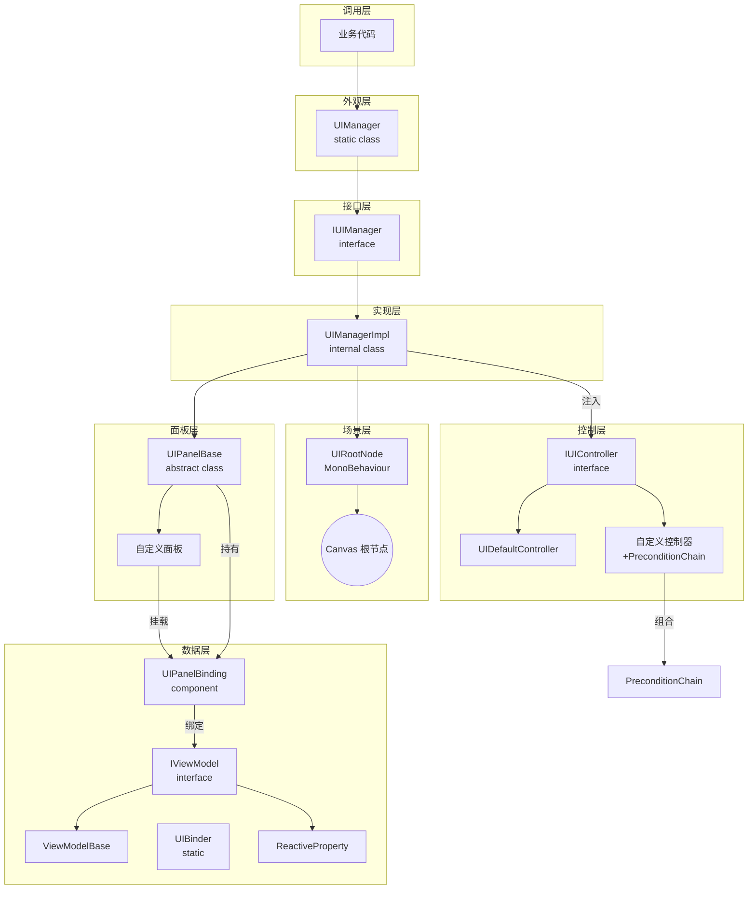
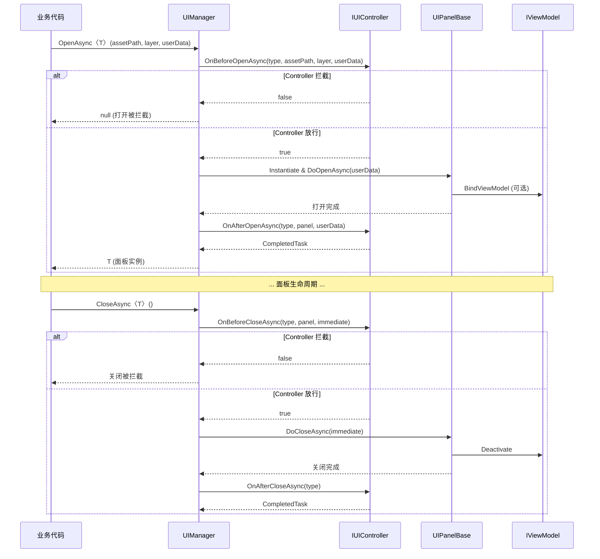

# XFramework / UI 模块

## 概述

XFramework UI 模块提供完整的 UI 面板管理功能。通过 `IUIManager` 接口抽象，支持面板打开/关闭、导航堆栈、模态遮罩、资源预加载缓存、层级排序以及与本地化模块的联动。所有面板预制体通过 YooAsset（`AssetManager`）异步加载，支持打开/关闭动画。

此外还提供 **MVVM 数据绑定**（View ↔ ViewModel 基于 ReactiveProperty）、**调度控制**（通过 IUIController + PreconditionChain 实现面板生命周期 AOP 拦截）以及 **世界空间 HUD**（NPC名/血条 3D 跟踪）和 **临时提示 Tip**（扣血/浮动文字）。

**命名空间**: `XFramework.XUI`

## 架构设计

本模块按四个子目录分层（骨架见下节「四层架构」）：

| 分组 | 装什么 |
|---|---|
| 根目录 | 门面、接口、层级 / 排序 / 遮罩等基础类型 |
| `Controller/` | 调度控制与前提条件链 |
| `Data/` | ViewModel、绑定与面板消息 |
| `Tip/` | 临时提示 |
| `View/` | 面板 / HUD / 控件基类与场景根 |

> **ReactiveProperty\<T\>** 等响应式基础类型位于 `Runtime/Reactive/`，全局消息总线位于 `Runtime/Message/`（`XFramework.XMessage`），均不在 UI 模块目录下。

## 四层架构


```mermaid
flowchart TB
    subgraph 调用层
        A[业务代码]
    end

    subgraph 外观层
        B["UIManager<br/>static class"]
    end

    subgraph 接口层
        C["IUIManager<br/>interface"]
    end

    subgraph 实现层
        D["UIManagerImpl<br/>internal class"]
    end

    subgraph 控制层
        K["IUIController<br/>interface"]
        L["UIDefaultController"]
        M["自定义控制器<br/>+PreconditionChain"]
    end

    subgraph 数据层
        N["IViewModel<br/>interface"]
        O["ViewModelBase"]
        P["UIPanelBinding<br/>component"]
        PA["UIBinder<br/>static"]
        Q["ReactiveProperty<T>"]
    end

    subgraph 场景层
        E["UIRootNode<br/>MonoBehaviour"]
        F(("Canvas 根节点"))
    end

    subgraph 面板层
        G["UIPanelBase<br/>abstract class"]
        H[自定义面板]
    end

    A --> B
    B --> C
    C --> D
    D --> E
    E --> F
    D --> G
    G --> H

    D -->|注入| K
    K --> L
    K --> M
    M -->|组合| R["PreconditionChain"]

    H -->|挂载| P
    G -->|持有| P
    P -->|绑定| N
    N --> O
    N --> Q
```

## 生命周期流程（含 Controller 拦截）


```mermaid
sequenceDiagram
    participant Biz as 业务代码
    participant Mgr as UIManager
    participant Ctrl as IUIController
    participant Panel as UIPanelBase
    participant VM as IViewModel

    Biz->>Mgr: OpenAsync〈T〉(assetPath, layer, userData)
    Mgr->>Ctrl: OnBeforeOpenAsync(type, assetPath, layer, userData)
    alt Controller 拦截
        Ctrl-->>Mgr: false
        Mgr-->>Biz: null (打开被拦截)
    else Controller 放行
        Ctrl-->>Mgr: true
        Mgr->>Panel: Instantiate & DoOpenAsync(userData)
        Panel->>VM: BindViewModel (可选)
        Panel-->>Mgr: 打开完成
        Mgr->>Ctrl: OnAfterOpenAsync(type, panel, userData)
        Ctrl-->>Mgr: CompletedTask
        Mgr-->>Biz: T (面板实例)
    end

    Note over Biz,VM: ... 面板生命周期 ...

    Biz->>Mgr: CloseAsync〈T〉()
    Mgr->>Ctrl: OnBeforeCloseAsync(type, panel, immediate)
    alt Controller 拦截
        Ctrl-->>Mgr: false
        Mgr-->>Biz: 关闭被拦截
    else Controller 放行
        Ctrl-->>Mgr: true
        Mgr->>Panel: DoCloseAsync(immediate)
        Panel->>VM: Deactivate
        Panel-->>Mgr: 关闭完成
        Mgr->>Ctrl: OnAfterCloseAsync(type)
        Ctrl-->>Mgr: CompletedTask
    end
```

## 核心类型

| 类型                      | 所属层 | 职责                                                                                                                                      |
| ------------------------- | ------ | ----------------------------------------------------------------------------------------------------------------------------------------- |
| **UIManager**             | 外观层 | 全局 UI 管理器静态外观（单例）。所有调用入口。                                                                                            |
| **IUIManager**            | 接口层 | UI 管理器接口。定义所有可用操作。                                                                                                         |
| **UIManagerImpl**         | 实现层 | 内部实现。维护活动面板字典、显示栈、遮罩管理、预加载缓存与排序计数器。支持注入 IUIController 拦截生命周期。                             |
| **UIPanelBase**           | View/  | 面板基类。提供 OnOpen / OnClose / OnFocus / OnBlur / OnUpdate / OnLanguageChanged 等生命周期方法与动画钩子，内置 ViewModel 绑定。         |
| **UIViewBase**            | View/  | UI 视图抽象基类。提供 Canvas / Raycaster 管理、层级属性、OnUpdate 集中驱动、OnPoolRecycle 回池钩子。UIPanelBase 与 UIHudItem 的公共父类。 |
| **UIHudItem**             | View/  | HUD 元素基类。继承 UIViewBase，每帧跟随 3D 目标的屏幕坐标，目标丢失时自动触发回收，支持屏幕偏移。                                         |
| **UIRootNode**            | View/  | 挂在场景 Canvas 上的 Mono。仅负责初始化/销毁 UIManager（销毁只在自己是当前根时发生）与提供层级参考值——每帧驱动已迁至 UpdateManager，它不再参与逐帧调度。 |
| **IUIController**         | 控制层 | **调度控制接口**。五阶段生命周期拦截：打开前/后、关闭前/后、全部关闭后。                                                                  |
| **UIDefaultController**   | 控制层 | 默认实现，全部放行。通过 Debug.Log 输出拦截日志。                                                                                         |
| **PreconditionChain**     | 控制层 | **前提条件链**。在自定义 Controller 的 OnBeforeOpenAsync 中链式组合校验条件。                                                             |
| **IViewModel**            | 数据层 | **ViewModel 接口**。标记型，纯粹的类型约束。                                                                                              |
| **ViewModelBase**         | 数据层 | ViewModel 抽象基类。封装 ReactiveProperty 的创建与订阅归口，生命周期为 OnBound / OnUnbound / Dispose（无 InitializeAsync）。              |
| **UIPanelBinding**        | 数据层 | **UI 绑定组件**。挂载在 Panel Prefab 上，持有 IViewModel 引用，提供约定式绑定（BindByConvention）与生命周期管理。                         |
| **UIBinder**              | 数据层 | **UI 绑定工具**。静态扩展方法，提供 BindToText/BindToSlider/BindToClick 等精确绑定，支持 format 格式化。与 UIPanelBinding 互补。          |
| **ReactiveProperty\<T\>** | 数据层 | **响应式属性**。值变更时自动通知订阅者，是 View ↔ ViewModel 数据绑定核心。                                                                |

## 门面形态

`UIManager` 是**扁平**的静态门面：每个成员都与 `IUIManager` 的对应成员**同名**。绝大多数转发体是 `EnsureGlobalInitialized()` + `_instance.X(...)` 两行；**例外是那组探测型读接口**——它们不加守卫、未初始化时直接返回空值（见下节「未初始化时的行为」）。没有嵌套分组类。

扁平层也容纳接口之外的三类成员：生命周期与实例管理（`Initialize` / `SetInstance` / `Destroy`），接口成员之外的 `SetController` / `TierDriverCount`，以及三种面板消息的 `Subscribe` 重载。

### 未初始化时的行为

门面成员按「探测」与「操作」分成两类，**这条分界由 `UIFacadeProbeTests` 钉住**，改一边会立刻倒掉另一边：

| 类别 | 成员 | 未初始化时 |
|---|---|---|
| 探测型读接口 | `IsInitialized`、`UIRoot`、`GetState`、`DumpState`、`TierDriverCount`、`OpenCount`、`IsAnyOpen`、`Panels`、`CanGoBack`、`IsMaskShowing` | 返回空值 / 全零快照 / 空视图（`Panels` 返回 `Array.Empty` 而非 null），**不抛异常**——它们本就该能在 `Initialize` 之前回答「现在什么样」 |
| 其余全部（含读接口） | `IsOpen<T>` / `GetPanel<T>` / `GetTopPanel` / `CopyPanels` / `CopyPanelsInLayer` 与所有开/关/推/弹/遮罩/Tip/HUD 成员 | 抛 `InvalidOperationException`（消息带 `[UIManager]` 前缀并给出修复提示） |

> **为什么 `IsOpen<T>` / `GetTopPanel` 这类「读」也照抛**：它们的实现要先剪枝再取，属「操作」而非纯读。判据不是「读还是写」，而是「未初始化时它能不能给出一个有意义的答案」。

> **为什么不用嵌套静态类分组**：分组会让转发时必然改名（`ShowHudAsync` → `Hud.Attach`、`ShowMask` → `Mask.Show`），「门面名 == 接口名」这条唯一的人工核对手段随之失效；而它换来的只有 IntelliSense 分组——本模块之外，`MessageManager`（48 个成员）、`InputManager`（43 个）、`AssetManager`（37 个）都保持扁平，靠 `#region` 分区。

### 扩展清单

新增 `IUIManager` 成员时，**必须同步在门面加静态转发**，否则它在第三方眼里根本不存在——`SetLayerVisibility` 就曾经长期处于这种状态：方法完整、文档也有，但只在内部实现上，门面既无转发也无实例属性，第三方实际完全调不到。

`UIFacadeCompletenessTests` 把这条锁住了：接口每个声明成员，在门面上必须存在**同名**的 public static 成员。判据只查名字、不查签名——签名由编译器兜底（转发体是经 `IUIManager` 的调用，签名不符根本编译不过），所以测试不需要任何映射表，也就不会成为第二份真相。它拦不住的是「转发接错线」（`SetLayerVisibility` 转发到了 `SetLayerInteractive`）与「假转发」（空实现、抛异常），那两条只能靠行为测试。

## 核心概念

### 层级系统

使用 `int` 类型表示层级，数值越大越靠前。推荐值在 `UILayers` 里，也可自定义：

```
Background (0)   — 背景层（主界面背景）
Default (100)    — 默认层（大部分面板）
Popup (200)      — 弹出层（弹窗、确认框）
Top (300)        — 顶层（Toast、加载提示、系统消息）
Mask (500)       — 模态遮罩层（ShowMask 的默认值）
```

**排序空间**由 `UISorting` 单点定义，**不要在别处硬编码 `sortingOrder`**：

| 带 | 取值 | 说明 |
| --- | --- | --- |
| 面板层 | `layer × 32 + 层内序号` | 层上限 `MaxPanelLayer = 899`、每层最多 31 个面板，超出会告警并钳制 |
| 遮罩 | `maskLayer × 32 + 31` | 取该层末位：挡住该层及以下、被更高层盖住 |
| HUD | `30000` | 高于全部面板层 |
| Tip | `31000` | 高于 HUD |
| 预留 | `32000` | 新手引导挖洞层、全局加载遮罩 |

> ⚠️ **为什么取值必须这么紧：`Canvas.sortingOrder` 是 16 位有符号量。**
>
> 它名义上是 `int`，但运行时只保留 `[-32768, 32767]`，写入超出的值会被**静默截断回绕**：
> 实测 `100001 → -31071`、`500000 → -24288`、`990000 → 6960`，不报任何错。
>
> 因此「`layer × 1000`」这类看起来很自然的写法只要层号 ≥ 33 就全盘失效——本框架早先正是如此，
> 层 200 实存 `+3393`、层 300 实存 `-27679`，于是 Top 层反而渲染在 Popup 之下。
> 所有取值一律经 `UISorting` 推导，`UISortingTests.EveryBandValue_SurvivesCanvasRoundTrip`
> 会拦住任何越界的新取值。

**层内序号 = 显示栈中的相对次序**：面板每次入栈/出栈后整体重排，于是排序与显示栈是同一份真相，不存在「计数器用久了溢出到邻层区间」的问题。

### 显示栈与导航

**所有打开路径都会入栈**（`OpenAsync` 与 `PushAsync` 都在内），栈序即显示次序。两者的区别只在语义读法上，不在行为上——所以「先 `OpenAsync` 开主界面、再 `PushAsync` 开二级页」之后依然可以 `PopAsync` 退回。

- `PushAsync` — 打开新面板并入栈，当前栈顶失焦（OnBlur），新面板获得焦点（OnOpen）
- `OpenAsync` — 同样入栈；已打开则聚焦（BringToFront）而不重复创建
- `PopAsync` — 弹出栈顶面板并关闭，恢复新栈顶焦点（OnFocus）
- `GoBackAsync` — 等价于 `PopAsync`，语义化命名，供返回键处理调用
- `PopToAsync<T>` — 依次弹出栈顶，直到指定类型成为栈顶
- `PopToRootAsync` — 依次弹出栈顶，只保留最早打开的那一个
- `CanGoBack` — 显示栈中是否还有可退回的面板（栈深 > 1）

**栈底面板不参与弹出**：栈深为 1 时 `PopAsync` 是 no-op，用 `CloseAsync` 关闭最后一个面板。

**同类型单实例**：同一面板类型同时只允许一个实例，重复打开会聚焦已有实例而非新建。显示栈因此与活动面板一一对应。

### 模态遮罩

通过 `ShowMask` / `HideMask` 创建全屏半透明遮罩，阻止下方 UI 交互：

- 支持设置透明度（alpha 0-1）
- 支持点击关闭（clickToClose）—— 点击遮罩自动 Pop 栈顶面板
- 遮罩位于独立层级（默认 Mask 层），不影响面板排序

### 面板驱动更新（OnUpdate）

与每个面板挂载独立 `MonoBehaviour.Update()` 不同，XFramework 由 **UIManager 集中驱动**面板的 `OnUpdate`。`UIManager.Initialize`（以及 `SetInstance`）把驱动器注册进 `UpdateManager` 的统一调度，故这条通路**可被档位降频、可被 `UpdateManager.Pause` 统一暂停**，也不再要求场景里存在 `UIRootNode`。

派发时只驱动「已打开且未暂停」的面板（被覆盖而失焦的面板不计入）。

> ⚠️ **这条通路挂在 `UpdateManager` 的「逻辑时间轴」上（`UpdateTimeMode.Scaled`），因此 `Time.timeScale = 0` 会把 UI 一起冻住**：面板 `OnUpdate`、HUD 跟随、Tip 动画全部停止派发——这是切换 `timeScale` 暂停游戏时最容易踩的一条。门面**没有**时间轴开关（驱动器类型是 private），唯一的逃生口是自己在需要时每帧手动调 `UIManager.Update(deltaTime, time)`；注意它会与驱动器**叠加**（见该方法注释），恢复 `timeScale` 后要么停掉手动调用，要么先 `Destroy` 再自行驱动。
>
> **异常隔离**：面板 `OnUpdate` 抛异常时，只记一条 `[UIManager]` 错误并**停更该面板**（其余面板 / HUD / Tip 照常，驱动器也不会被调度器注销）；该面板下次打开（回池复位）后恢复被驱动。HUD / Tip 的 provider 抛异常时则继续驱动、只记首条日志（换 provider 后重新计数）。

**优势：**
- **性能可控** — 仅一个 `Update(float deltaTime, float time)` 入口，避免引擎层为每个面板产生原生调用开销（借鉴 GameFramework `UIForm.OnUpdate` 设计）
- **状态感知** — 暂停的面板（失焦状态）自动跳过更新，无需面板内部自行判断
- **可扩展** — 未来可按优先级、分组等策略精细控制更新顺序

```csharp
public class GameHudPanel : UIPanelBase
{
    // 注意修饰符：OnUpdate 是 protected internal，跨程序集覆写必须沿用同一修饰符，
    // 写成 protected 会得到 CS0507「cannot change access modifiers」
    protected internal override void OnUpdate(float deltaTime, float time)
    {
        // 仅在面板打开且未暂停时执行
        UpdateHealthBar(deltaTime);
        UpdateAmmoDisplay();
    }
}
```

> ⚠️ **`deltaTime` 不是 `Time.deltaTime`**
>
> 它是**距上次派发**的间隔。面板可以声明较低档位而被降频派发（见 `UpdateTier`），此时两者相差整数倍——
> 继续用 `Time.deltaTime` 做积分会慢若干倍。任何累加/插值都必须用传入的 `deltaTime`。
>
> 好处是：只要按它积分，面板无论跑在哪个档位、甚至中途改档，行为都一致。

> ⚠️ **OnUpdate 与 ReactiveProperty 的使用边界**
>
> **ReactiveProperty 是推模式（事件驱动），OnUpdate 是拉模式（帧驱动），两者职责互补，不应混用。**
>
> - **ReactiveProperty** — 数据变化时自动推送，绑定后无需手动更新 UI。适用于健康值、货币数量、开关状态等**事件驱动**的数据刷新。
> - **OnUpdate** — 按档位周期派发，适用于倒计时、进度条插值、拖拽跟随、位置追踪等**帧驱动**的持续逻辑。
>
> ❌ **反模式：在 OnUpdate 中轮询 ReactiveProperty 手动刷新 UI**
> ```csharp
> protected internal override void OnUpdate(float deltaTime, float time)
> {
>     // 错误：_vm.Health 已通过 UIBinder 绑定到 healthText，
>     // 每帧再手动 Set 健康值是一种冗余更新
>     healthText.text = _vm.Health.Value.ToString();
> }
> ```
>
> ✅ **正确区分：绑定用 ReactiveProperty，帧驱动用 OnUpdate**
> ```csharp
> protected override async UniTask OnOpen(object userData)
> {
>     // ReactiveProperty 绑定 — 值变化自动推送到 UI，无需 OnUpdate 参与
>     _vm.Health.BindToText(healthText, v => $"HP: {v}");
>     _vm.Score.BindToText(scoreText, v => $"{v:N0}");
> }
>
> protected internal override void OnUpdate(float deltaTime, float time)
> {
>     // OnUpdate — 纯帧驱动逻辑，与 ReactiveProperty 无关。
>     // 用传入的 deltaTime，不用 Time.deltaTime
>     _countdownTimer -= deltaTime;
>     _countdownText.text = Mathf.CeilToInt(_countdownTimer).ToString();
> }
> ```

### 资源缓存

预加载面板预制体到内存缓存，后续 `OpenAsync` 时直接从缓存实例化：

```csharp
// 预加载——后续打开时不卡顿
await UIManager.PreloadAsync<SettingsPanel>("ui/panels/settings");

// 移除指定缓存
UIManager.ForgetPreload<SettingsPanel>();

// 清空所有缓存（切换场景时）
UIManager.ClearPreloads();
```

## 快速使用

### 1. 场景设置

在场景中创建一个 `UIRootNode`：

1. 右键 → `GameObject` → `UI` → `Canvas` 创建 Canvas
2. 向 Canvas 添加 `UIRootNode` 组件（`Add Component → UIRootNode`）
3. Canvas 的 `Render Mode` 自动设为 `Screen Space - Overlay`

`UIRootNode` 的 `Awake` 中若尚未初始化则自动调用 `UIManager.Initialize(transform)`；`OnDestroy` 中**只有它自己正是当前根**时才清理——叠加场景下卸载别的节点，不该把另一个场景仍在用的管理器拆掉。

管理器是全局单例，故整个运行期只应有一个生效的根：第二个场景里的 `UIRootNode` 会被忽略（它的面板依旧挂在第一个根下）。需要多根属于另一类需求，本模块不预设。

也可以在代码中手动初始化并注入自定义 Controller：

```csharp
// 代码初始化 + 注入自定义 Controller
var uiRoot = GameObject.Find("UIRoot").transform;
UIManager.Initialize(uiRoot, new MyGameController());
```

### 2. 自定义 Controller（可选：调度控制）

如果你不需要面板打开/关闭的拦截逻辑，可以跳过此步骤。默认 Controller 全部放行。

```csharp
using System;
using System.Threading;
using Cysharp.Threading.Tasks;
using XFramework.XUI;
using XFramework.XUI.Controller;
using XFramework.XUI.View;

/// <summary>
/// 业务自定义控制器：面板打开前校验登录状态、关闭时的二次确认等。
/// </summary>
/// <remarks>
/// 五个方法都带 <c>CancellationToken cancellationToken = default</c>——接口上的默认参数值
/// <b>不允许实现方省略参数</b>，漏掉会直接报 CS0535。
/// </remarks>
public class MyGameController : IUIController
{
    public async UniTask<bool> OnBeforeOpenAsync(
        Type panelType, string assetPath, int layer, object userData,
        CancellationToken cancellationToken = default)
    {
        // 使用 PreconditionChain 链式组合校验条件
        var chain = new PreconditionChain(panelType, assetPath, layer, userData)
            .Add(CheckLoginAsync)
            .Add(CheckDailyLimitAsync);

        return await chain.ExecuteAsync();
    }

    public UniTask OnAfterOpenAsync(Type panelType, UIPanelBase panel, object userData,
        CancellationToken cancellationToken = default)
        => UniTask.CompletedTask;

    public async UniTask<bool> OnBeforeCloseAsync(
        Type panelType, UIPanelBase panel, bool immediate,
        CancellationToken cancellationToken = default)
    {
        // 关闭前的二次确认弹窗
        if (panelType == typeof(ShopPanel))
        {
            if (!immediate)
            {
                var confirmed = await ShowConfirmDialog("确定要关闭商店吗？");
                return confirmed;
            }
        }
        return true;
    }

    public UniTask OnAfterCloseAsync(Type panelType, CancellationToken cancellationToken = default)
        => UniTask.CompletedTask;

    public UniTask OnAllPanelsClosedAsync(CancellationToken cancellationToken = default)
        => UniTask.CompletedTask;

    // --- 前提条件示例 ---

    private async UniTask<bool> CheckLoginAsync(
        Type panelType, string assetPath, int layer, object userData)
    {
        // 某些面板不需要登录
        if (panelType == typeof(LoginPanel) || panelType == typeof(RegisterPanel))
            return true;

        if (!GameManager.Instance.IsLoggedIn)
        {
            // 自动弹出登录面板。层级用 UILayers 的常量而非裸数字——500 是遮罩层，
            // 登录面板落在那里会被自己的遮罩盖住
            await UIManager.PushAsync<LoginPanel>("Assets/UI/Login.prefab", UILayers.Popup);
            return false; // 中断链
        }
        return true;
    }

    private UniTask<bool> CheckDailyLimitAsync(
        Type panelType, string assetPath, int layer, object userData)
    {
        return UniTask.FromResult(true);
    }

    private async UniTask<bool> ShowConfirmDialog(string message)
    {
        // 框架没有内建的「等你回结果」通道：结果由面板自己经 userData 带回来。
        // 弹窗面板在用户点确定/取消时调 result.TrySetResult(...)，这里等它。
        var result = new UniTaskCompletionSource<bool>();

        await UIManager.PushAsync<ConfirmDialog>(
            "Assets/UI/ConfirmDialog.prefab", UILayers.Popup, result);

        return await result.Task;
    }
}
```

### 3. MVVM 数据绑定（可选）

**3.1 两种绑定风格**

| 风格                   | 类                                     | 适合场景                                                            |
| ---------------------- | -------------------------------------- | ------------------------------------------------------------------- |
| **约定式**（零代码）   | `UIPanelBinding`（MonoBehaviour 组件） | 标准面板，子节点按 `txt_xxx` / `img_xxx` / `sld_xxx` / `tgl_xxx` / `btn_xxx` 命名，按属性名匹配 |
| **精确式**（手动控制） | `UIBinder`（静态扩展方法）             | 需要 format 格式化、按钮点击绑定、非标准组件、大世界 UI             |

两者互补，可在同一个面板中混用。

**3.2 创建 ViewModel**

```csharp
using XFramework.XUI.Data;

public class SettingsViewModel : ViewModelBase
{
    // 使用 ViewModelBase 的 CreateProperty 方法创建响应式属性
    public ReactiveProperty<float> MusicVolume { get; private set; }
    public ReactiveProperty<bool> SoundEnabled { get; private set; }
    public ReactiveProperty<string> PlayerName { get; private set; }

    // ViewModelBase 的生命周期只有三个：OnBound / OnUnbound / Dispose。
    // 它没有 InitializeAsync——属性在 OnBound 里创建即可，面板 new 出 VM 后
    // 直接 BindViewModel 就会走到这里。
    protected override void OnBound()
    {
        MusicVolume = CreateProperty(0.5f);
        SoundEnabled = CreateProperty(true);
        PlayerName = CreateProperty("Player");

        // 订阅交给 AddSubscription 归口：面板回池时由 Unbind 统一释放
        AddSubscription(MusicVolume.Subscribe(v => Debug.Log($"音量变化: {v}")));
    }

    protected override void OnUnbound()
    {
        // 面板关闭 / 回池时由 UIPanelBinding.Unbind 调用
        SaveSettings();
    }
}
```

**3.3 在面板中使用 ViewModel（约定式 — UIPanelBinding）**

```csharp
public class SettingsPanel : UIPanelBase
{
    protected override async UniTask OnOpen(object userData)
    {
        var vm = new SettingsViewModel();
        BindViewModel(vm);   // 前置：内部调用 vm.OnBound()（属性在那里创建）并缓存子节点组件

        // 再按名字逐个绑定。约定式绑定既不遍历 ViewModel、也不吃 Inspector 拖的引用——
        // 它按「前缀 + 属性名」在子节点里找（见 3.4），所以每个属性都要显式调一次。
        Binding.BindByConvention("MusicVolume", vm.MusicVolume);     // 子节点须名为 sld_MusicVolume
        Binding.BindByConvention("SoundEnabled", vm.SoundEnabled);   // 须名为 tgl_SoundEnabled
        Binding.BindByConvention("PlayerName", vm.PlayerName);       // 须名为 txt_PlayerName
    }
}
```

> `BindViewModel` **不绑定任何属性**——它只调用 `vm.OnBound()` 并缓存子节点组件，是上面那三行的**前置条件**，不是它们的替代写法。框架没有「遍历 ViewModel 属性自动全绑」这回事。

**3.4 命名约定（BindByConvention）**

约定式绑定**不是自动的**：要为每个属性显式调一次 `Binding.BindByConvention("属性名", vm.属性)`。它拿「**前缀 + 属性名**」去子节点缓存里找（按名、不区分大小写、**最多 5 层深度**），前缀决定绑到哪类组件：

| 子节点名            | 组件                                   | 绑到的成员    | 对属性值类型的要求                    |
| ------------------- | -------------------------------------- | ------------- | ------------------------------------- |
| `txt_{属性名}`      | `Text`（UGUI 旧版文本，**非 `TMP_Text`**） | `text`        | 任意类型（直接 `ToString()`）         |
| `img_{属性名}`      | `Image`                                | `sprite`      | `IReactiveProperty<Sprite>`           |
| 同上                | `Image`                                | `color`       | `IReactiveProperty<Color>`            |
| 同上                | `Image`                                | `fillAmount`  | `IReactiveProperty<float>`            |
| `sld_{属性名}`      | `Slider`                               | `value`       | `IReactiveProperty<float>`            |
| `tgl_{属性名}`      | `Toggle`                               | `isOn`        | `IReactiveProperty<bool>`             |

- **查找顺序即优先级**：`txt_` → `img_` → `sld_` → `tgl_`，命中即返回。同一属性名若存在多种前缀的节点，靠前的那种生效。
- **类型不匹配等于没绑**：`sld_` 只认 `float`、`tgl_` 只认 `bool`——给 `sld_` 配 `IReactiveProperty<int>` 绑不上（`int` 与 `float` 之间没有隐式接口转换）。此时只在**编辑器**里打一条「未找到」告警，Release 下完全静默。
- **按钮走另一条路**：`btn_{名字}` → `Button.onClick`，经 `Binding.BindClick("名字", 回调)` 绑定。按钮不是「值的来源」，故不在上表。
- **组件在绑定前必须就位**：缓存是 `BindViewModel` / `Binding.Bind` 时一次性建立的，运行时新加的子节点不在缓存里，需重新 `CacheComponents`。
- **不覆盖 `TMP_Text` / `TMP_InputField`**：想要 TMP、输入框或格式化，用 3.5 的精确式绑定（`BindToText` 收 `TMP_Text`）。

**3.5 精确式绑定（UIBinder）**

适用于需要格式化、按钮点击、非标准组件或大世界 UI 等场景：

```csharp
using XFramework.XReactive;
using XFramework.XUI.Data;

public class ShopPanel : UIPanelBase
{
    public TMP_Text currencyText;
    public Button btnBuy;
    public Image hpBar;

    private ShopViewModel _vm = new ShopViewModel();

    protected override UniTask OnOpen(object userData)
    {
        BindViewModel(_vm);   // 内部会调用 _vm.OnBound()，属性在那里创建

        // 绑定方法返回的 IDisposable 一律交给 Track 归口：面板是回池而非销毁，
        // 挂在 OnDestroy 上的释放永不触发，Track 才是「随视图生命周期释放」的出口。
        Track(_vm.Currency.BindToText(currencyText, g => $"{g:N0}"));
        Track(_vm.HpRatio.BindToFillAmount(hpBar));       // 派生值在 VM 里建，见下
        Track(btnBuy.BindToClick(_vm.OnClickBuy));
        Track(_vm.Level.Bind(lv => SetLevelBadge(lv)));
    }
}

public class ShopViewModel : ViewModelBase
{
    public ReactiveProperty<int> Currency { get; private set; }
    public ReactiveProperty<int> Hp { get; private set; }
    public IReactiveProperty<float> HpRatio { get; private set; }
    public ReactiveProperty<int> Level { get; private set; }

    // 属性在 OnBound 里创建，不要在构造函数里建：Unbind 会 Dispose 掉 VM，
    // 构造函数建的属性活不过第二次 Bind
    public override void OnBound()
    {
        Currency = CreateProperty(0);
        Hp = CreateProperty(100);
        Level = CreateProperty(1);

        // 派生值必须有人持有并释放：Select 在构造时就会订阅源，把返回值就地丢弃
        // 等于让这个派生值永久订阅下去（每次源变化都还会跑一遍 selector）。
        // CreateReadOnlyProperty 是「创建 + 归口」的合并形式，随 VM 一起释放。
        HpRatio = CreateReadOnlyProperty(Hp, h => h / 100f);
    }

    public void OnClickBuy() { /* ... */ }
}
```

### 4. 创建面板

所有 UI 面板需继承 `UIPanelBase`：

```csharp
using XFramework.XUI;

public class MainMenuPanel : UIPanelBase
{
    protected override async UniTask OnOpen(object userData)
    {
        // 面板打开逻辑：绑定按钮事件、初始化文本等
        var title = transform.Find("Title").GetComponent<TMP_Text>();
        title.text = "主菜单";

        // 创建并绑定 ViewModel（可选）
        var vm = new MainMenuViewModel();
        BindViewModel(vm);
    }

    protected override async UniTask OnClose()
    {
        // 面板关闭逻辑：清理事件绑定、释放资源等
    }

    // 可选：打开动画
    protected override async UniTask PlayOpenAnimation()
    {
        var canvasGroup = GetComponent<CanvasGroup>();
        canvasGroup.alpha = 0f;
        await canvasGroup.FadeIn(0.3f); // DOTween 或自定义
    }

    // 可选：关闭动画
    protected override async UniTask PlayCloseAnimation()
    {
        var canvasGroup = GetComponent<CanvasGroup>();
        await canvasGroup.FadeOut(0.2f);
    }

    // 可选：语言切换回调
    protected override void OnLanguageChanged(string lang)
    {
        // 刷新面板文本
    }
}
```

### 5. 打开/关闭面板

```csharp
using XFramework.XUI;

// 打开面板
var mainMenu = await UIManager.OpenAsync<MainMenuPanel>(
    "ui/panels/mainmenu",    // YooAsset 预制体地址
    layerDefault,             // 层级（可选，默认 100）
    userData                  // 自定义数据（可选，默认 null）
);

// 关闭面板（通过类型）
await UIManager.CloseAsync<MainMenuPanel>();

// 关闭面板（带关闭动画）
await UIManager.CloseAsync<MainMenuPanel>(immediate: false);

// 关闭面板（立即销毁，跳过动画）
await UIManager.CloseAsync<MainMenuPanel>(immediate: true);

// 面板关闭自身
await this.CloseSelfAsync();

// 查询面板状态
bool isOpen = UIManager.IsOpen<MainMenuPanel>();
var panel = UIManager.GetPanel<MainMenuPanel>(); // 未打开返回 null
```

### 6. 显示栈与导航

```csharp
// 主菜单：用 OpenAsync 打开——它同样入栈，后续可以 Pop 回退
await UIManager.OpenAsync<MainMenuPanel>("ui/panels/mainmenu", layerDefault);

// 进入设置——主菜单失焦，设置面板获得焦点
var settings = await UIManager.PushAsync<SettingsPanel>(
    "ui/panels/settings",
    layerDefault
);

// 从设置进入音效子面板
await UIManager.PushAsync<SoundPanel>("ui/panels/sound", layerDefault);

// 返回上一面板（关闭音效面板，恢复设置面板）
await UIManager.GoBackAsync();

// 或使用 PopAsync（等价于 GoBackAsync）
await UIManager.PopAsync();

// 直接从音效回到主菜单（中间的面板依次关闭）
await UIManager.PopToAsync<MainMenuPanel>();

// 全部退到最底层（只留最早打开的那一个）
await UIManager.PopToRootAsync();

// 检查是否可以返回——接返回键时用它判断
if (UIManager.CanGoBack)
{
    await UIManager.GoBackAsync();
}
```

### 7. 模态遮罩

```csharp
// 显示遮罩（半透明，不支持点击关闭）
UIManager.ShowMask(alpha: 0.5f);

// 显示遮罩（支持点击关闭——自动 Pop 栈顶）
UIManager.ShowMask(alpha: 0.3f, clickToClose: true);

// 隐藏遮罩
UIManager.HideMask();

// 查询遮罩状态
bool showing = UIManager.IsMaskShowing;
```

### 8. 关闭指定层级

```csharp
// 关闭 Default 层的所有面板
await UIManager.CloseLayerAsync(layerDefault);

// 关闭所有面板，并一并回收世界空间 HUD 与在播 Tip
await UIManager.CloseAllAsync();
// 注意：遮罩不在其列——它是引用计数句柄，要一起收需显式 HideMask()
```

### 9. 资源预加载

```csharp
// 游戏启动后预加载所有常用面板，后续打开零延迟
await UIManager.PreloadAsync<MainMenuPanel>("ui/panels/mainmenu");
await UIManager.PreloadAsync<SettingsPanel>("ui/panels/settings");
await UIManager.PreloadAsync<DialogPanel>("ui/panels/dialog");

// 场景切换时清理不用的缓存
UIManager.ClearPreloads();
```

### 10. 语言切换联动

语言切换通过 `MessageManager` 发布 `LanguageChangedMessage`，`UIManager` 自动订阅并刷新所有已打开面板，**无需手动注册**。

面板中重写 `OnLanguageChanged` 方法即可：

```csharp
public class MainMenuPanel : UIPanelBase
{
    public TMP_Text titleText;

    protected override void OnLanguageChanged(string lang)
    {
        titleText.text = LocalizationManager.Get("ui_main_title");
    }
}
```

或者使用 `UIBinder.BindToLocalizedText` 扩展方法，**无需重写 `OnLanguageChanged`**：

```csharp
using XFramework.XUI.Data;

// 绑定后语言切换时自动刷新，返回 IDisposable 可存入 UIPanelBinding._bindings 统一管理
titleText.BindToLocalizedText("ui_main_title");
```

### 11. 事件监听

面板生命周期事件通过 `MessageManager` 发布/订阅。消息体使用 `readonly struct`，零 GC 分配。

模块另提供归口入口 `UIManager.Subscribe(...)`，三个重载分别对应面板打开 / 面板关闭 / 全部关闭，并额外接受一个**生命周期上下文**：传 `MonoBehaviour` 或实现 `IDestroyCancellationToken` 的普通 C# 对象（ViewModel / Model），对象销毁时自动退订；两者皆非时不绑定并打一条告警，此时需自行持有句柄释放。

```csharp
// 归口入口：订阅随面板/对象的生命周期自动取消
UIManager.Subscribe((PanelOpenedMessage msg) => Debug.Log(msg.PanelType.Name), this);

// 非 MonoBehaviour 的 ViewModel 同样可用（实现 IDestroyCancellationToken 即可）
UIManager.Subscribe((PanelClosedMessage msg) => OnPanelClosed(msg), _viewModel);
```

```csharp
using XFramework.XUI.Data;
using XFramework.XMessage;

// 面板打开事件
var token1 = MessageManager.Subscribe<PanelOpenedMessage>(msg =>
{
    Debug.Log($"Panel opened: {msg.PanelType.Name}");
});

// 面板关闭事件
var token2 = MessageManager.Subscribe<PanelClosedMessage>(msg =>
{
    Debug.Log($"Panel closed: {msg.PanelType.Name}");
});

// 所有面板关闭事件
var token3 = MessageManager.Subscribe<AllPanelsClosedMessage>(_ =>
{
    Debug.Log("All panels closed.");
});

// 取消订阅（避免内存泄漏）：订阅句柄本身即 IDisposable
token1.Dispose();
token2.Dispose();
token3.Dispose();
```

> 静态 API 不自动绑定生命周期，句柄需在使用方销毁时 `Dispose`；若订阅方实现 `IMessageSubscriber`，改用 `this.Subscribe(...)` 即可自动绑定销毁时机（MonoBehaviour 或 `IDestroyCancellationToken`）。
>
> **`UIManager.Subscribe` 的 `context` 三种取值**：传 `MonoBehaviour` / `IDestroyCancellationToken` 对象 → 销毁时自动退订；传**两者皆非**的对象 → 不绑定并打一条告警（留痕，免得「对象已经没了，回调还在跑」）；传 **null** → 不绑定、**不打告警**（这是「我就是要自己管句柄」的正常用法）。

### 12. 依赖注入

支持注入自定义 `IUIManager` 实现：

```csharp
// 注入自定义实现（可用于单元测试）
var mockManager = new MockUIManager();
UIManager.SetInstance(mockManager);

// 注入自定义 Controller（运行时替换拦截逻辑）
UIManager.SetController(new MyCustomController());
```

注入的实例同样接入每帧驱动（`UIManager.Update` 转发给它），**分档驱动器只对框架自带的实现生效**——档位需求由 `UIManagerImpl` 读面板声明后上报，注入实现退化为「只有每帧档」。

> ⚠️ **`SetController` 只对 `UIManagerImpl` 生效**：上面示例里先 `SetInstance(mockManager)` 再 `SetController(...)`，第二步只会打一条告警、控制器**不生效**（它需要 `UIManagerImpl` 的注入点）。自定义 Controller 请在同一实例上配：要么用框架自带实现时调 `SetController`，要么走 `Initialize(uiRoot, controller)`，要么在自己的 `IUIManager` 实现里自行处理拦截。
>
> **实例所有权**：`SetInstance` 换实例时只销毁**门面自己创建**的那个（`Initialize` 那条路径），注入进来的不碰；但 `Destroy()` 是「拆掉全局 UI」的终局操作，**无论来源一律销毁**——注入的实现在 `Destroy()` 里会被 `Dispose()`，请确保那时你已经不需要它。

## 设计原则

- **四层架构** — 外观层、控制层、数据层、面板层各司其职
- **接口可替换** — 通过 `IUIManager` 接口，可替换底层实现
- **静态外观** — `UIManager` 提供全局入口，任意位置可直接调用
- **层级灵活** — `int` 类型表示层级，第三方项目可自由定义常量扩展
- **显示栈导航** — 所有打开路径统一入栈，支持 Push/Pop/PopTo/PopToRoot，Blur/Focus 焦点管理
- **资源缓存** — 预加载面板预制体到缓存，后续打开时零加载延迟
- **动画支持** — `PlayOpenAnimation` / `PlayCloseAnimation` 可重写，支持 DOTween 等
- **多语言联动** — `OnLanguageChanged` 与 `LocalizationManager` 无缝集成
- **AOP 调度控制** — 通过 IUIController 五阶段生命周期拦截 + PreconditionChain 链式校验
- **MVVM 数据绑定** — 基于 ReactiveProperty 的 View ↔ ViewModel 双向/单向绑定，支持约定式（UIPanelBinding）与精确式（UIBinder）两种风格
- **面板驱动更新** — UIManager 集中驱动 OnUpdate，仅已打开且未暂停的面板执行（借鉴 GameFramework 设计）
- **HUD 世界空间** — UIHudItem 自动 3D→屏幕坐标转换，目标丢失自动回收，与面板共享 UIViewBase 驱动
- **避免 GC** — 使用固定字典容量（8/4）、值类型遍历、List 复用，减少 GC 分配

## HUD 世界空间 UI（NPC / 怪物头顶名字、血条、标记）

`UIHudManagerImpl` + `UIHudItem` 提供持久化的世界空间 HUD，适用于需要持续跟随 3D 目标的 UI，如 NPC/怪物头顶名字、血条、状态图标、距离指示器等。HUD 与面板共享 `UIViewBase` 的 OnUpdate 集中驱动，内部通过 `AssetManager` 管理对象池。

**命名空间**: `XFramework.XUI` / `XFramework.XUI.View`

> **HUD 与 Tip 的区别**：Tip 是**临时一次性**提示（扣血数字飘几秒消失），HUD 是**持久跟随**目标的 UI（血条始终挂在怪物头上直到目标死亡或手动隐藏）。

### 架构

```
UIManager.ShowHudAsync<T>(target, assetPath, offset)  →  静态外观
    │
    └── UIHudManagerImpl.AttachAsync<T>()              →  内部管理器（去重、映射、容器）
            │
            ├── AssetManager.InstantiateAsync()     →  从对象池获取实例
            ├── hud.DoOpenAsync()                   →  打开 HUD（初始化 Camera 等）
            └── ActiveHudList.Add(hud)              →  注册到每帧更新列表
                    │
            UIManager.Update(deltaTime, time)       →  集中驱动
                    │
            hud.OnUpdate(deltaTime, time)           →  世界坐标转屏幕坐标 + 跟随
                    │
            FollowTarget == null?  →  自动触发 OnTargetLost → Detach + 回池
```

- `UIHudManagerImpl` 是 `IUiHudProvider` 的默认实现（可用 `UIManager.SetHudProvider` 替换），在 UIRoot 下自动创建 `Layer_HUD` 独立 Canvas（sortingOrder = 30000），确保 HUD 始终在所有面板之上
- `UIHudItem` 继承自 `UIViewBase`，与面板共享 `OnUpdate` 集中驱动机制
- 一个 3D 目标同时只能绑定一个 HUD，重复调用 `ShowHudAsync` 会自动替换旧 HUD

### 快速使用

```csharp
using XFramework.XUI;
using XFramework.XUI.View;

// 1. 自定义 HUD 脚本（挂载到 HUD 预制体上）
public class MonsterHpBar : UIHudItem
{
    [SerializeField] private Image _hpFill;
    [SerializeField] private TMP_Text _nameText;

    private Monster _monster;

    protected override async UniTask OnOpenImpl(object userData)
    {
        await base.OnOpenImpl(userData);
    }

    // 修饰符与签名同样必须与基类一致（protected internal + 两个时间参数）
    protected internal override void OnUpdate(float deltaTime, float time)
    {
        base.OnUpdate(deltaTime, time); // 必须调用 base，执行位置跟随逻辑

        if (_monster == null)
            return;

        if (_hpFill != null)
            _hpFill.fillAmount = _monster.Hp / _monster.MaxHp;
    }

    public void Bind(Monster monster)
    {
        _monster = monster;
        if (_nameText != null)
            _nameText.text = monster.Name;
    }
}

// 2. 显示 HUD
var hud = await UIManager.ShowHudAsync<MonsterHpBar>(
    monster.transform,               // 跟随的 3D 目标
    "ui/hud/monster_hpbar",          // 预制体地址
    new Vector2(0, 80)               // 屏幕偏移（头顶上方 80 像素）
);
hud.Bind(monster);

// 3. 隐藏 HUD（目标死亡 / 离开视野时）
UIManager.HideHud(monster.transform);
```

### API 说明

| API                                               | 说明                                                      |
| ------------------------------------------------- | --------------------------------------------------------- |
| `UIManager.ShowHudAsync<T>(target, assetPath, offset)` | 为目标附加 HUD，返回实例。同一目标重复调用自动替换旧 HUD  |
| `UIManager.HideHud(target)`                       | 分离指定目标的 HUD，自动回池。target 为 null 时无操作     |
| `UIHudItem.FollowTarget`                          | 要跟随的 3D 目标 Transform。设为 null 会触发自动回收      |
| `UIHudItem.ScreenOffset`                          | 屏幕坐标偏移（像素），常用于将 HUD 移到目标头顶上方       |
| `UIHudItem.CanvasGroup`                           | 懒加载的 CanvasGroup 引用，用于控制整体透明度             |
| `UIHudItem.RectTransform`                         | 懒加载的 RectTransform 引用，OnUpdate 中自动更新 position |

### 生命周期与自动回收

目标丢失时 HUD 会自动回收，无需手动管理：

- **目标被销毁**（`FollowTarget == null`）：下一帧 `OnUpdate` 检测到 → 触发 `OnTargetLost` 事件 → `UIHudManagerImpl` 自动 Detach + 回池
- **目标移到镜头后方**（`screenPos.z <= 0`）：CanvasGroup.alpha 自动设为 0（隐藏但未回收）
- **场景切换 / 全部关闭**：`UIManager.CloseAllAsync` 会触发 `UIHudManagerImpl.DetachAll()`，回收所有 HUD

### 预制体要求

第三方项目需自行设计 HUD 预制体，要求如下：

- **根节点挂载自定义脚本**：继承 `UIHudItem` 的脚本（如 `MonsterHpBar`）
- **Canvas**：由 `UIViewBase` 的 `[RequireComponent(typeof(Canvas))]` 自动添加
- **GraphicRaycaster**：由 `UIViewBase` 的 `[RequireComponent(typeof(GraphicRaycaster))]` 自动添加
- **CanvasGroup**：由 `UIHudItem` 的 `[RequireComponent(typeof(CanvasGroup))]` 自动添加

> 预制体挂载到 `Layer_HUD` 容器后，Canvas 的 rendering 层级由 `UIHudManagerImpl` 统一控制（独立 Canvas，sortingOrder = 30000）。

### 设计要点

- **一对一绑定** — 一个 3D 目标同时仅一个 HUD，重复 Attach 自动替换旧实例
- **自动回收** — 目标丢失或为 null 时自动触发回收，无需手动释放
- **独立 Canvas** — `Layer_HUD` 容器拥有独立 Canvas（sortingOrder = 30000），确保 HUD 渲染在最高层
- **集中驱动** — 与 UIPanel 共享 `UIViewBase.OnUpdate` 集中驱动，避免分散的 `MonoBehaviour.Update` 开销
- **对象池** — 由 `AssetManager` 管理实例化与回池，避免频繁创建/销毁
- **镜头感知** — 目标在镜头后方时自动隐藏（alpha=0），回到视野时自动恢复

## Tip 临时提示（扣血提示 / 浮动文字）

`UITipManagerImpl` + `UITipItem` 提供无需交互的临时浮动提示，如扣血数字、暴击提示、获得物品等。内部通过 `AssetManager` 泛型接口实例化预制体并复用对象池，动画完成后自动回收。

**命名空间**: `XFramework.XUI`

### 架构

```
UIManager.ShowTipAsync(text, config)  →  静态外观
    │
    └── UITipManagerImpl.ShowTipAsync()    →  内部管理器（实例化、容器、回池）
            │
            ├── AssetManager.InstantiateAsync<UITipItem>()  →  获取组件实例（含对象池）
            ├── tipItem.PlayAsync()                         →  异步播放动画
            └── AssetManager.DestroyInstance()              →  回池
```

- `UITipManagerImpl` 是 `IUITipProvider` 的默认实现（可用 `UIManager.SetTipProvider` 替换），在 UIRoot 下自动创建 `Layer_Tip` 独立子 Canvas（排序值取 `UISorting.TipOrder`），确保 Tip 始终在所有面板之上
- `UIManager.CloseAllAsync` 会一并回收在播 Tip（与 HUD 同理：它们不是面板，但共享同一个 UIRoot 与生命周期。遮罩不在其列——它是引用计数句柄，需显式 `HideMask()`）
- `UITipItem` 基于 UniTask 的异步循环驱动帧动画，支持 `CancellationToken` 取消

### 快速使用

```csharp
// 最简单的版本 — 屏幕居中白色文字，2 秒后消失
UIManager.ShowTipAsync("-10");

// 扣血提示 — 红色、上飘、跟随敌人世界坐标
UIManager.ShowTipAsync("-50", new TipConfig 
{ 
    WorldPos = enemy.transform.position, 
    Color = Color.red, 
    FloatDistance = 50f 
});

// 暴击提示 — 黄色大字
UIManager.ShowTipAsync("暴击！999", new TipConfig 
{ 
    Color = Color.yellow, 
    FontSize = 36f, 
    Duration = 3f 
});
```

### TipConfig 参数

| 参数            | 类型       | 默认值             | 说明                                         |
| --------------- | ---------- | ------------------ | -------------------------------------------- |
| `WorldPos`      | `Vector3?` | `null`（屏幕居中） | 3D 世界坐标，自动转为屏幕坐标                |
| `Color`         | `Color`    | `Color.white`      | 文字颜色                                     |
| `Duration`      | `float`    | `2f`               | 显示时长（秒）。前半程保持不透明，后半程渐隐 |
| `FloatDistance` | `float`    | `0f`（不飘）       | 上飘像素距离                                 |
| `FontSize`      | `float`    | `0f`（预制体默认） | 字号，0 表示使用预制体默认值                 |

### 预制体要求

第三方项目需在资源包中提供名为 `PF_UITipText` 的预制体，需挂载以下组件：

- **TextMeshPro - Text (UI)** — 文字渲染，名称不限，`UITipItem` 会通过 `GetComponentInChildren` 自动查找
- **CanvasGroup** — 透明度控制（`UITipItem` 通过 `[RequireComponent(typeof(CanvasGroup))]` 自动添加）
- **UITipItem** — Tip 播放逻辑（框架提供，挂载到预制体根节点）

预制体通过 `AssetManager` 的资源系统加载，**对象池由 `AssetManager` 统一管理**，无需额外配置。

## 已知限制

- **关闭域重载（Enter Play Mode Options）时，UI 的会话复位依赖 `UIRootNode` 的成对生命周期**：
  `UIRootNode.Awake` 里「未初始化才 `Initialize`」与 `OnDestroy` 里「我是当前根才 `Destroy`」构成闭环，
  正常场景卸载即可自洽；**但绕过 `UIRootNode` 手动调 `UIManager.Initialize` 的项目**在第二个播放会话里
  会继续挂在上一轮的实例上（`Initialize` 是「已初始化则忽略」，使用方无法自救）。同类根因与验证手段见
  `../Input/README.md` 的已知限制。
- 多根场景未覆盖：第二个场景的 `UIRootNode` 会被静默忽略（面板仍挂在第一个场景的根下）——单根是既有
  设计，见 `View/UIRootNode.cs` 的注释。
- **面板资源不会自动卸载**：需显式调 `UnloadPanelAssetAsync`（配套 Asset 侧的 `IAssetPoolController`）。
  **没有**做按 LRU 自动卸载——那是策略，应由项目决定何时调用。
- **`Time.timeScale = 0` 会冻结整条 UI 每帧通路**（面板 `OnUpdate`、HUD 跟随、Tip 动画），因为驱动器挂在
  `UpdateManager` 的逻辑时间轴上。门面没有时间轴开关，逃生口与注意事项见「面板驱动更新」一节的警告框。
- **外部调用 `UpdateManager.Clear()` 会摘掉 UI 的驱动器**：它是公开 API，UI 无从感知，只有下一次
  `UIManager.Initialize` / `SetInstance` 才会重新注册（门面已不再信任自身记账）。若你的重置流程里调了它，
  请在同一流程里重新进入 UI 的生命周期入口，否则界面会静默静止。
- **UI 没有任何线程契约的运行时断言**：面板 / HUD / Tip 的创建、开合与驱动都必须在主线程调用（Unity 对象
  本身的约束），模块不做检测也不做切线程——跨线程调用是未定义行为。

## 设计取舍

以下三件事**框架刻意不内建**——不是没来得及做，而是它们要么是叶子组件、要么会替项目决定生命周期策略。
每条给出理由与「你可以怎么做」。

### 列表虚拟化由项目自建

框架**没有**列表 / 滚动控件：`UIBinder` 与约定式绑定都是「**一属性 → 一控件**」，没有集合绑定；对象池的池化
对象是**面板 / HUD / Tip 实例**，不是列表条目。长列表（背包、排行榜、聊天）请自建，三块料都在：

- 条目预制体 —— `AssetManager.InstantiateAsync<T>()` 自带对象池，回池用 `AssetManager.DestroyInstance()`；
- 条目内的控件 —— 照常用 `UIBinder.BindToText` / `BindToClick` 等（绑定的是**控件**，与是不是列表无关）；
- 滚动与窗口化 —— UGUI 的 `ScrollRect` + 你自己的可见窗口计算。

**为什么不内建**：列表是**叶子组件**，它不与面板生命周期、统一调度、排序空间、遮罩中的任何一项耦合
（对照：Tip / HUD / 遮罩都是跨切面基础设施，所以它们内建）。而各项目的条目类型、分页、选中、多列布局
差异极大，框架做一套只会两头不讨好。

### 切场景：两种正解，框架不做自动检测

`UIRootNode` **不带** `DontDestroyOnLoad`，也不做任何跨场景引用检测。切场景有两条正解：

- **UIRoot 常驻**：把 UI 根放进常驻场景（或自行给它 `DontDestroyOnLoad`），面板跨场景存活。离开前用
  `CloseAllAsync()` 收口（它一并回收 HUD 与在播 Tip；**不含遮罩**——遮罩是引用计数句柄，见该方法的文档）。
- **每场景一根**：`UIRootNode` 的成对生命周期自动接管——旧场景卸载时它 `Destroy()` 整个管理器（面板 / HUD /
  Tip 全部回池），新场景的节点再 `Initialize()`。注意管理器是全局单例，**同时只允许一个生效的根**（后到的
  被静默忽略，见「已知限制」）。

**为什么不做「自动检测跨场景引用」**：它只能靠反射扫用户对象图，与本框架「反射仅用于 Type 驱动的 API 边界
与配置元数据提取」的约定冲突；而「自动处理」（替调用方清引用、关面板）等于替项目决定生命周期策略——
那是架构，不是基础设施。跨场景的引用该由面板自己在 `OnClose` / `OnPoolRecycle` 里解开。

### 特效层用保留排序带自建

框架**没有**内建 UI 特效层（粒子、叠加特效），但排序空间已经给它留好了位置：`UISorting.SystemOrder = 32000`
（高于 HUD 的 30000 与 Tip 的 31000，注释里就写着「新手引导挖洞层、全局加载遮罩」）。自建做法与仓内的
`Layer_HUD` / `Layer_Tip` 同形：

```csharp
var canvasGo = new GameObject("Layer_Effect", typeof(RectTransform));
canvasGo.transform.SetParent(UIManager.UIRoot, false);        // UIRoot 是公开属性
var canvas = canvasGo.AddComponent<Canvas>();
canvas.overrideSorting = true;                                 // 子 Canvas 必须开，否则排序不生效
canvas.sortingOrder = UISorting.SystemOrder;                   // 用保留带，不要另取数字
// 要挡住下方输入再加 GraphicRaycaster；粒子系统挂在 canvasGo 下即可
```

**为什么不内建**：特效 Canvas 的结构取决于项目用哪种相机（Screen Space Overlay / Camera / RenderTexture）、
是否需要挡输入、要不要与 3D 场景共深度——框架替它定一套，项目多半还得拆掉重做。

## 依赖

- `XFramework.XAsset` — 通过 `AssetManager.InstantiateAsync` 加载面板预制体
- `UniTask`（框架层已提供）
- UGUI（`UnityEngine.Canvas`、`UnityEngine.UI.GraphicRaycaster`）
- 可选：`XFramework.XLocalization`（语言切换联动）